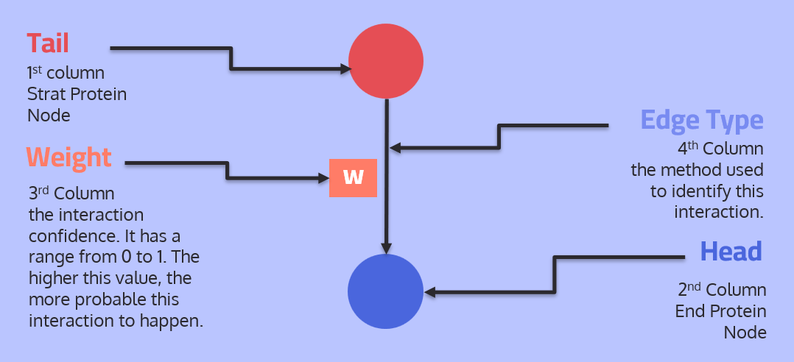
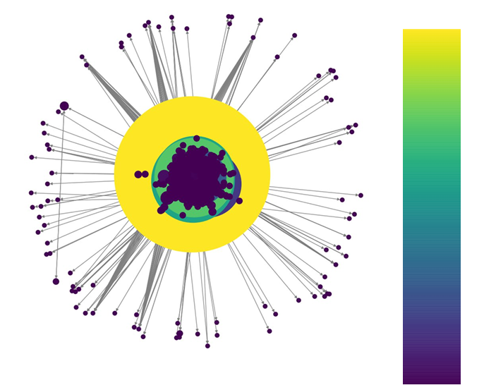
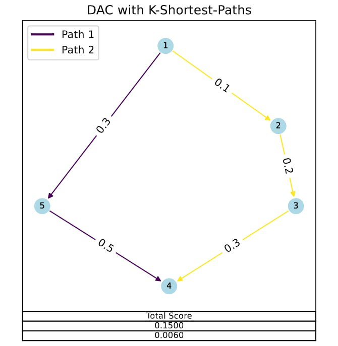
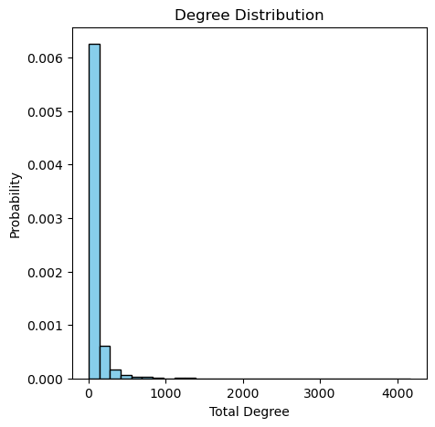
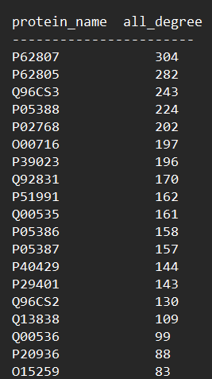

# Protein-Protein-Interactions-Analysis-

## Overview 

Biological processes have evolved to intricate systems where proteins act as crucial components, guiding specific pathways. Proteins play a pivotal role in determining molecular mechanisms and cellular responses, making the analysis of protein interaction networks essential for understanding cellular processes, disease mechanisms, and identifying potential therapeutic targets.

In this repository, we focus on the analysis of a Protein-Protein Interaction (PPI) network in humans. The network is represented by a directed interactome file, `PathLinker_2018_human-ppi-weighted-cap0_75.txt`. This file encapsulates valuable information about protein interactions, including the UniProt IDs of interacting proteins, interaction confidence scores, and the methods used to identify these interactions. You can find this file in the [Dataset](Dataset) folder

## Dataset Description 

- The file represents a directed interactome, where each interaction starts from the tail node to the head node.
- Each line of the file consists of four pieces of information:
    1. Tail protein node (UniProt ID).
    2. Head protein node (UniProt ID).
    3. Interaction confidence (range 0 to 1).
    4. Method used to identify the interaction.

<p align="center">
  
</p>


## Analysis Procedures  

### 1. Constructing the Biological Network

To begin our analysis, we'll construct the biological network using the NetworkX Python package. This involves utilizing the provided interactome file, "PathLinker_2018_human-ppi-weighted-cap0_75.txt," which represents a directed interactome. Each interaction in the file includes the UniProt IDs of the interacting proteins **(nodes)**, the interaction confidence score **(weight)**, and the method used for identification.

<p align="center">
  
</p>

### 2. Acyclic Shortest Paths

Given two proteins, we aim to find and list the acyclic shortest path(s) between them in a text file. The analysis includes providing the total path score, the weight of each interaction in the path(s), and reporting all available paths.

<p align="center">
  
</p>

### 3. Directly Connected Proteins

For a given protein, we'll list all directly connected proteins in a text file. This analysis includes reporting the degree (number of connections) of the selected protein in a separate line. Each connected protein will be provided with its corresponding interaction weight.

### 4. Proteins Degree Analysis

When given a set of proteins, we'll draw a histogram to visualize their degree distribution. Additionally, we'll rank these proteins from highly connected to least in a text file, with each line representing a protein and its corresponding degree. This is useful in identifying the Hubs in the network. 


<p align="center">
  
  
</p>
### 5. UniProt ID to Gene Name Conversion

This analysis involves providing a conversion map between the protein UniProt ID and its gene name. The script will support conversion for either one protein ID or a set of protein IDs, enabling users to obtain their corresponding gene names.

### 6. Unweighted Graph Conversion

The final step is to convert the existing graph into an unweighted graph using the adjacency matrix method. The unweighted graph will be saved for further analysis.


## Key Findings
The analysis resulted in proving these properties about PPIN: 
- Small World Effect 
- Scale-free Property
- Transitivity  

**For a more in-depth understanding of the methodology and analysis, please refer to the notebook and attached paper.**


## Installation

To set up the required environment for the Protein-Protein Interactions Analysis, follow these steps:

1. **Clone the Repository:**
    ```bash
    git clone git@github.com:joyou159/Protein-Protein-Interactions-Analysis-.git
    cd Protein-Protein-Interactions-Analysis
    ```

2. **Create a Virtual Environment (Optional but Recommended):**
    ```bash
    python -m venv venv
    source venv/bin/activate   
    ```

3. **Install Dependencies:**
    ```bash
    pip install -r requirements.txt
    ```

## Contribution

 Your contributions are welcome in unraveling the complexities of protein-protein interaction networks!


## Acknowledgments

**This project was supervised by [Dr. Ibrahim Youssef](https://github.com/Ibrahim-Youssef), who provided invaluable guidance and expertise throughout such incredible journey as bioinformatics course at Cairo University Faculty of Engineering.**

<div style="text-align: right">
    
</div>

